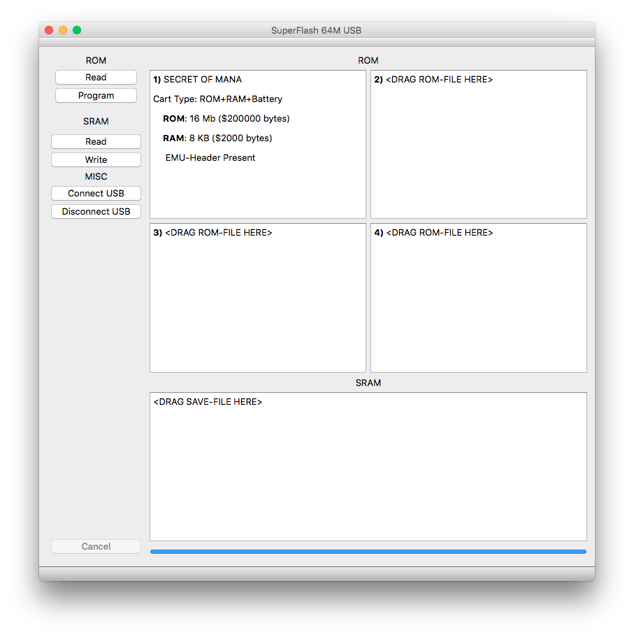

# SuperFlashUSB
USB programmer circuit design, firmware, and PC software for Tototek SNES Flash cart.

Originally, the Tototek flash cart ships only with a parallel port programmer. However, legendary snes programmer Shay Green aka blargg reverse engineered the cartridge's internal protocol. Based on that RE, I started designing a USB programmer hardware, embedded firmware, and PC-side GUI app so that I could use my beloved cartridge on modern computers lacking parallel port technology.

Although Shay had unlocked a crucial key, there was more RE work to be done. For example, when more than 1 game is loaded onto the cartridge, the traditional software crafts a loader ROM that provides a custom menu to select the program you want to run after powering on the SNES. At specific locations in this ROM bits are set accordingly to reflect each ROM's specific properties. etc. etc. etc.

(Other Story from my recollection)

At the time, the FTDI usb-to-serial chip was a very popular choice to integrate USB capability with less powerful microcontrollers, such as Atmel AVR 16-bit chips. While the AVR could do the simple flash programming cheaply, the FTDI would handle the more complicated and speedy USB handling. All-in-all this appeared to offer easier design to execute on financially and thoughtfully, as no knowledge of the USB protocol intricacies were necessary.

However, at this same time some simple Atmel chips were released that included the ability to handle native USB. I set my sight on attempting using one of those chips. Long story short, it was a lot more difficult. But, I got to learn a lot about USB protocol, so there's that.

If my memory serves me correctly, I had problems running the chip's internal oscillator at 16MHz, everything would only function at 8MHz. I remember trying to use a crystal to see if it would help at all. But before I was able to do more powerful in-circuit debugging, it was time to move on.

## GUI

File loading was made fun via QT Gui and File Drop capability. By simpling dragging ROM files from your filesystem into the windowed areas of the GUI, you could get everything loaded up. A preview of the ROM's details appears. you then click 'Program' to send that custom crafted package over to the cart via USB. You can also read your cart's ROM or SRAM contents into a file.

There are also Developer "Connect USB" and "Disconenct USB" buttons available for troubleshooting the connection during development.

### DISCLAIMER

This is an old hobby project of mine that fell between the cracks, so to speak. I openly admit it is a real mess! I can in no way provide support for this project or fans of the project wanting to build or buy the unit.

Unfortunately, this archive may be from an older stage of development. Even if you set out to build and compile it yourself, there is no guarantee it will work **in any way**. 

installation notes:
---------------------
Requires libusb-1.0, 

QT 5.2 asks for openGL header files (can use package freeglut3-dev)

Developer Machine Notes
-----------------------
As of April 2014 
ubuntu 12.04
synaptic package libusb-1.0-dev does not have support for hotplug. So you have to compile libusb it in manually. (include instructions)

If you install into a unique prefix, you must eg. soft link the libusb-1.0.pc file into /usr/lib/pkgconfig or else QTCreator will not see it.
